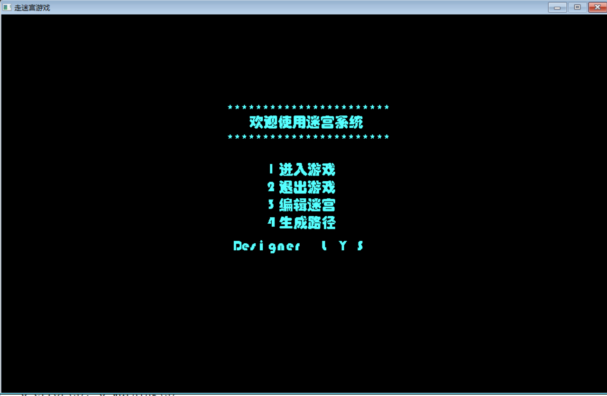
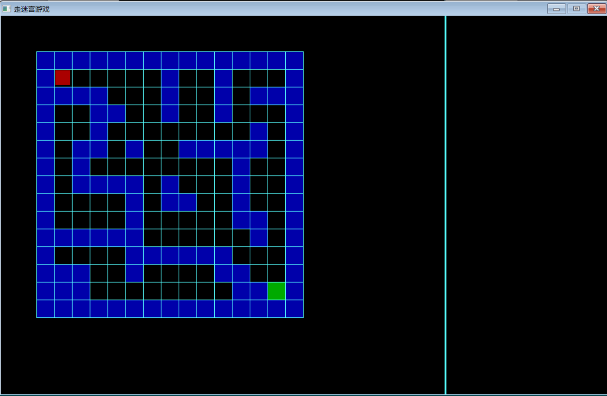
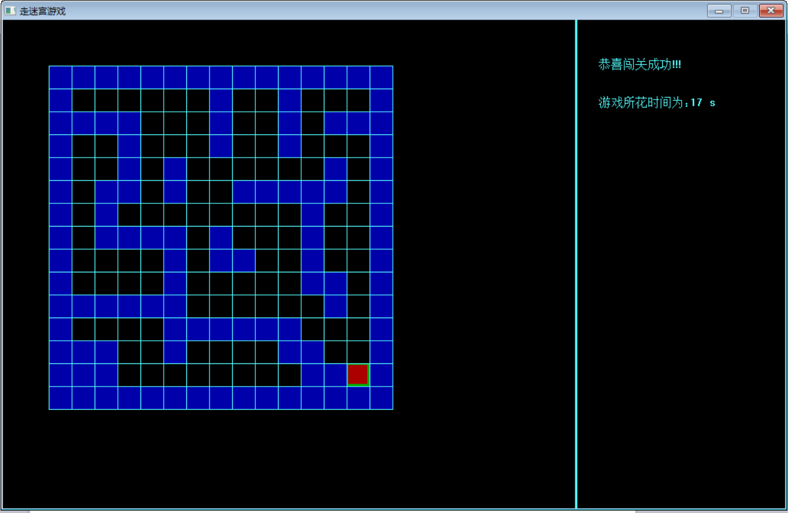
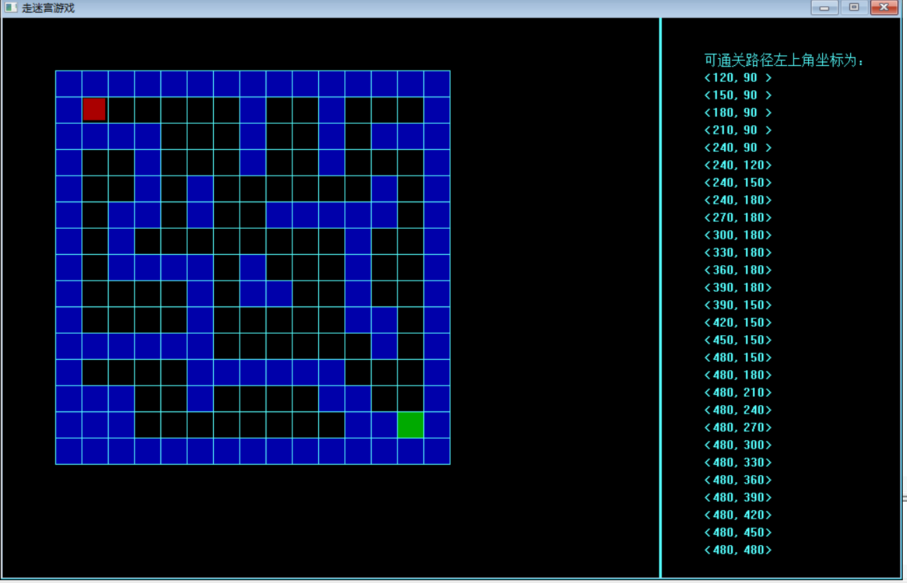
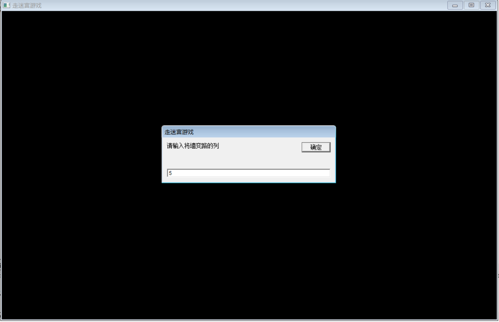
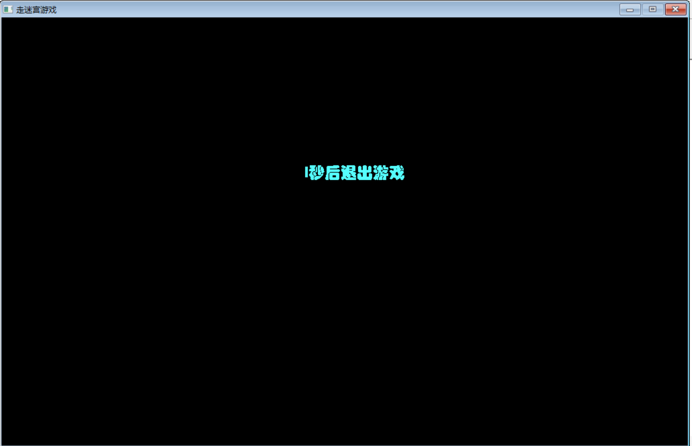

maze-design 走迷宫游戏
=======================
1.本游戏以数据结构中栈的先进后出结构为基础，使用C语言完成。
------------------------------------------------------
2.设计思想：
----------
（1）确定迷宫的储存结构：迷宫由每个小格子构成，所以把格子定义成一个结构体，里面存放每个格子左上角的横纵坐标。用数组存放整个迷宫。

（2）判断路径：用另一个数组来记录迷宫每个格子的状态，如果是墙就赋值为0，是路径就赋值为1。

（3）生成路径：利用栈的函数push(),判断上下左右死歌方向是否有路，将有路的方块进栈，最后将栈内元素弹出生成一条有效路径。

3.功能
------
(1)可用键盘操纵上下左右移动；

(2)迷宫的墙有明确标记，不能穿墙而过；

(3)添加编辑迷宫功能，可修改当前迷宫，修改内容：墙变路、路变墙；

(4)提供机器自动找出出路的功能，并标记路线；

(5)提供计时器，提示走迷宫所用时间；

(6)利用栈实现迷宫的功能；

4.效果图
--------

